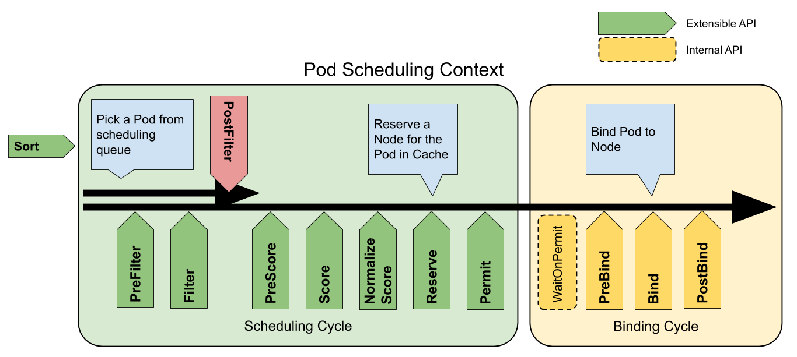

# 调度框架

[参考](https://github.com/kubernetes/enhancements/blob/master/keps/sig-scheduling/624-scheduling-framework/README.md#custom-scheduler-plugins-out-of-tree)

### Scheduling Cycle & Binding Cycle

对于一个pod的每次调度尝试可以分成两个阶段：调度周期(scheduling cycle)和绑定周期(binding cycle)。其中调度周期为一个pod选择一个节点，而绑定周期则将这个选择决策应用到kubernetes集群中。一个调度周期和一个绑定周期在一起被称作一个"scheduling context"。调度周期串行运行，而绑定周期则并行运行。

如果Pod不能被调度或者在调度/绑定中发生内部错误，调度周期或绑定周期会终止执行。被调度的Pod被重新放会调度队列中然后会被重新调度。如果绑定出错，将会触发Reserve插件的Unreserve方法(释放Reserve方法中为当前Pod保留的node上的资源)。

### Extension points

下图显示了Pod调度的上下文以及调度框架暴露的扩展点。在下图中"Filter"相当于原有调度方案中的"Predicate"，而"Scoring"则相当于原调度方案中的"Priority function"。已经注册的插件可以被下图中的一个或多个扩展点调用。

一个插件可以注册在多个扩展点用以实现复杂的或有状态的任务。

从上图看出，每个Pod的调度可能要经过10个阶段。依次为：QueueSort, PreFilter, Filter, PostFilter, PreScore, Score, Reserve, PreBinding, Binding, PostBinding。在每个阶段中可以有多个插件被调用，下面是每个阶段的主要操作。

#### Queue sort

Sort阶段主要为调度队列中的pod排序。每个`queue sort` 插件都需要提供一个`less(pod1, pod2)`的方法。在同一时间只能允许启用一个排序插件。

#### PreFilter

用来预处理Pod或检查集群/Pod是否满足特定的条件。每个pre-filter插件都需要实现`PreFilter`方法，如果PreFilter返回错误则调度周期终止执行。在一个调度周期中PreFilter会被调用一次。

每个Pre-Filter插件可以实现可选的`PreFilterExtensions`接口， 这个接口定义了`AddPod`和`RemovePod`方法。调度框架保证这些函数只在PreFilter后被调用，可能在调用针对每个节点的Filter前被调用多次。

#### Filter

Filter阶段用来过滤不能运行Pod的nodes。对于每个node，调度框架按照配置中的顺序依次执行每个Filter插件。如果有一个插件标记当前节点是不可用的，则针对此节点不会调用后续插件。多个节点可能并行执行，因此在同一调度周期内一个Filter插件可能调用多次。

#### PostFilter

在Filter执行后并且针对当前Pod没用可用node是被调用。此阶段中按照配置中的顺序依次调用每个插件。如果任何一个插件标记某个node是可用的，则终止调用后续插件。一个典型的PostFilter的实现是抢占，抢占尝试通过驱逐某个节点上的其他的Pod使当前Pod可以被调度。

#### PreScore

此阶段主要用来在为node打分前收集信息。Plugins will be called with a list of nodes that passed the filtering phase. 可以在此阶段更新内部状态或生成日志/metrics。

#### Scoring

scoring包括两个阶段：

1. 第一个阶段叫"score"，用来为通过Filter阶段的nodes打分。调度器会为每个node调用此阶段的每一个插件。
2. 第二个阶段叫"normalize scoring"，用来在调度器计算出一个所以可用nodes的等级前修正node的得分，and each score plugin receives scores given by the same plugin to all nodes in "normalize scoring" phase. `NormalizeScore` is called once per plugin per scheduling cycle right after "score" phase.  Note that `NormalizeScore` is optional, and can be provided by implementing the `ScoreExtensions` interface.